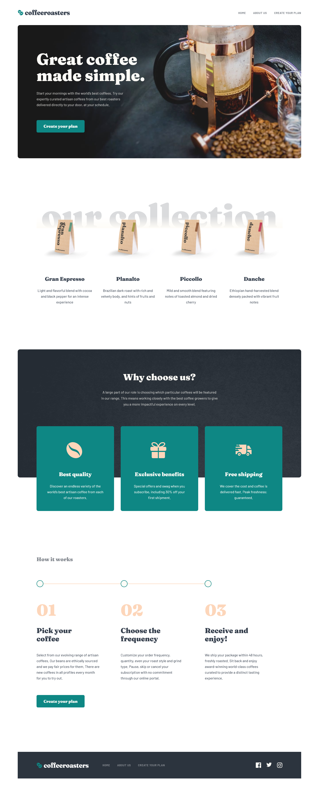
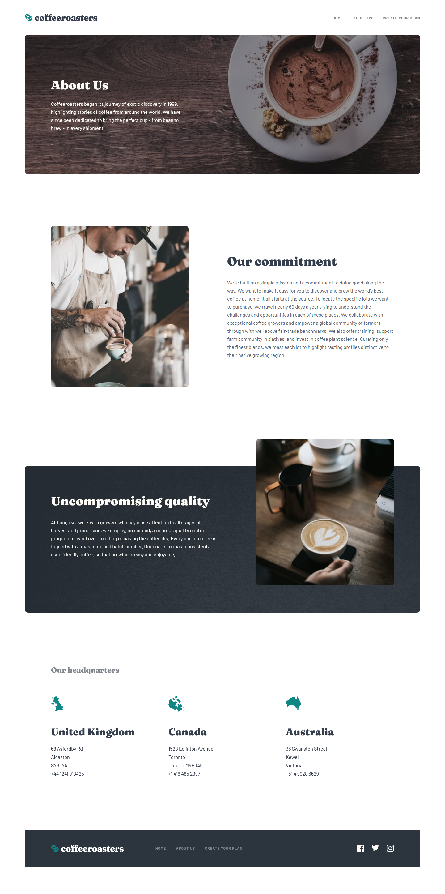
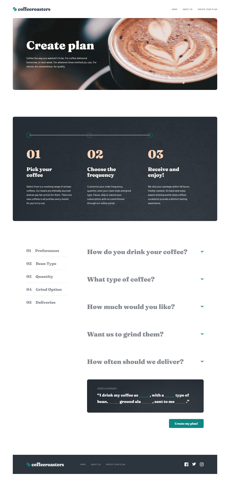
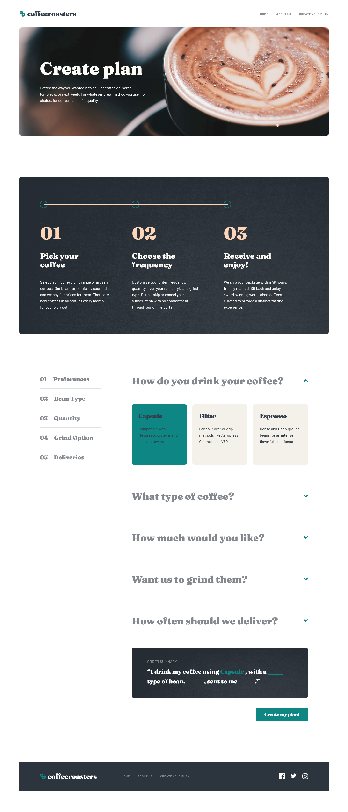
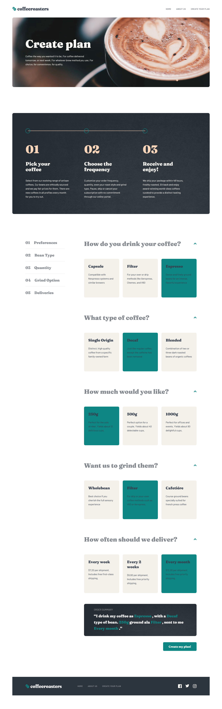
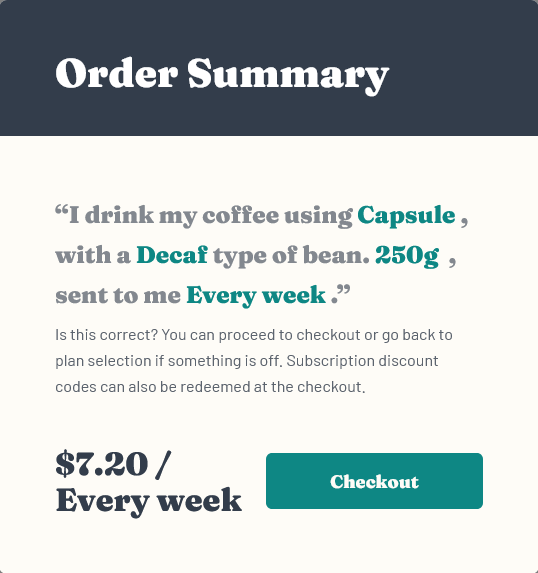
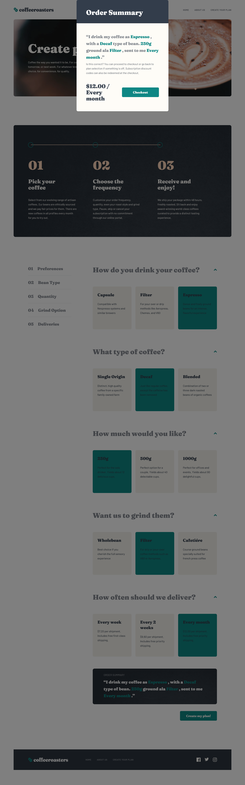

## Table of contents

- [Overview](#overview)
  - [The challenge](#the-challenge)
  - [Screenshot](#screenshot)
  - [Links](#links)
- [My process](#my-process)
  - [Built with](#built-with)
  - [What I learned](#what-i-learned)
  - [Continued development](#continued-development)
  - [Useful resources](#useful-resources)
- [Author](#author)
- [Acknowledgments](#acknowledgments)

## Overview

### The challenge

Users should be able to:

- View the optimal layout for each page depending on their device's screen size
- See hover states for all interactive elements throughout the site
- Make selections to create a coffee subscription and see an order summary modal of their choices

### Screenshot

### Links

-   Solution URL: https://github.com/erdemalpay/coffeeroasters-subscription-site
-   Live Site URL: https://nifty-lewin-0e3b49.netlify.app

## My process

### Built with

-   Semantic HTML5 markup
-   CSS custom properties
-   Flexbox
-   CSS Grid
-   Mobile-first workflow
-   [Svelte](https://svelte.dev/) - JS library

### What I learned

1- Adding background by assigning variable in html tag;

    

3- Using router to switch pages;

    export const routes = {
    "/": Home,
    "/about": AboutUsPage,
    "/subscribe": Subscribe,
    "*": Home,
    }

4- Assign $ to a variable to update the value of the variables in the function;

    $: totalPrice = total(valueQuantity, valueDeliveries);

5- Turning PopUp on and off within the page;

    --Assign variable to popup with condition;

    {#if showOrderSummaryPopUp}
        <main class:closeOrderSummaryPopUp>
        

    {/if}

    --Show-hide Popup within the page;

    export const togglePopUp = () => {
    showOrderSummaryPopUp = !showOrderSummaryPopUp;

};

### Continued development

While working on this project, I improved my missing knowledge in js, css and svelte. 
I will continue to develop my skills in future projects.

### Useful resources

https://css-tricks.com/ - This site helped me with its simple and fun explanation. I would recommend it to anyone who is still learning this concept.

## Author

-   Frontend Mentor - [@ZeynebKoc]https://www.frontendmentor.io/profile/ZeynebKoc/my-challenges
-   Frontend Mentor - [@EsraAlpay]https://www.frontendmentor.io/profile/EsraAlpay/my-challenges

## Acknowledgments

Thanks to Erdem Alpay and Esra Alpay for their help and support.
